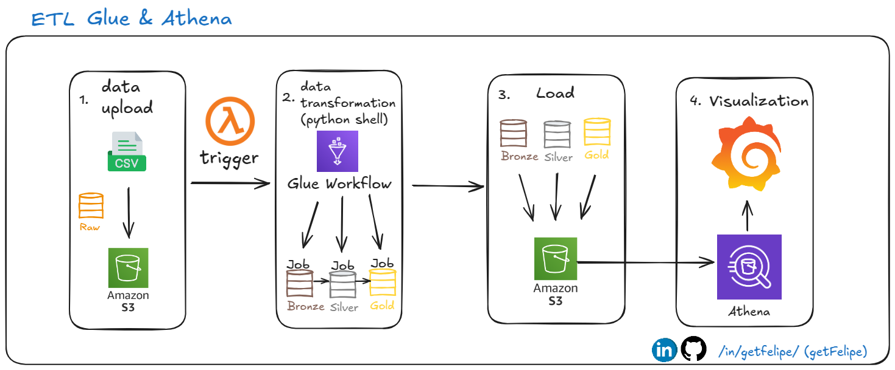
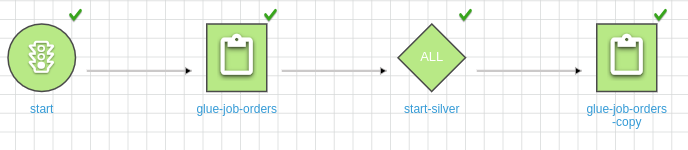
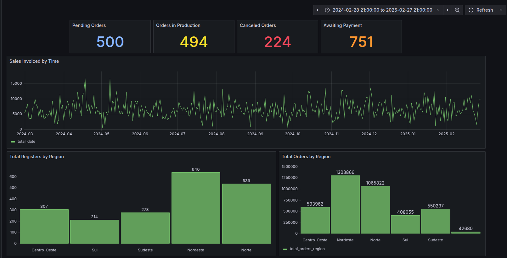

[](https://www.linkedin.com/in/getfelipe/) [](https://www.python.org/downloads/release/python-3120/)

[](https://medium.com/)

# AWS Glue, Athena, and Grafana: A Step-by-Step Guide to a Simple Data Pipeline

The goal of this project is to build a simple pipeline using AWS Glue, Athena, and Grafana. The architecture that I built is shown below:



## Data Overview

The fake data used consists of "Registers" and "Orders" that follows the structure below and can be found in files folder:

| **Registers Table** | **Orders Table** |
| ------------------- | ---------------- |
| `id`                | `order_id`       |
| `name`              | `cpf`            |
| `birth_date`        | `order_value`    |
| `cpf`               | `charges`        |
| `postal_code`       | `discount_value` |
| `country`           | `voucher`        |
| `city`              | `order_status`   |
| `state`             | `order_date`     |
| `address_street`    |
| `address_number`    |
| `gender`            |
| `marital_status`    |
| `phone`             |
| `email`             |
| `register_date`     |

### Transformation Architecture

The transformation process follows the Medallion Architecture and is organized into three layers:

- **Raw:** Contains the files in the S3 bucket.
- **Bronze:** Contains raw data uploaded to another bucket by Glue Job
- **Silver:** Applies transformations such as casting, removing duplicates, and using CASE statements to derive regional information.
- **Gold:** Contains the final metrics that will be used directly on the dashboard.

### ETL on Glue

This part consists of creating the workflow that Lambda will activate when a file is uploaded in the bucket.
Then, it will call the orders workflow to load the files in another bucket, convert them into Parquet, and create the date structure of folders for organizing as well as for the registers workflow. Lastly, the gold is only used with the queries in Athena and Grafana to produce the business metric. Check out the workflow below:



This is the Order ETL; the glue-job-orders is the bronze process, whereas the glue-job-orders-copy is about the silver process. Basically, the same happens to another register's workflow.

### Visualization

After the configuration of Athena for connecting the Silver bucket to the database, I will be able to connect Athena with Grafana to build the dashboard: the focus is on producing charts and insights by region—such as canceled orders, total orders, and order status.
Check out the result below.



## Repository Structure

```
|---> models     (Contains the bronze and silver transformation in Glue)
|---> files   (Contains a sample file uploaded in S3 to trigger the Lambda)
|---> assets    (Images)
|---> lambda.py  (Lambda code to start the workflow)
```

## Packages Used

- **boto3**
- **pandas**
- **datetime**
- **sys**

## For more details on configuration, read my Medium post:

Check out my Medium post: [AWS Glue, Athena, and Grafana: A Step-by-Step Guide to a Simple Data Pipeline](https://medium.com/)
